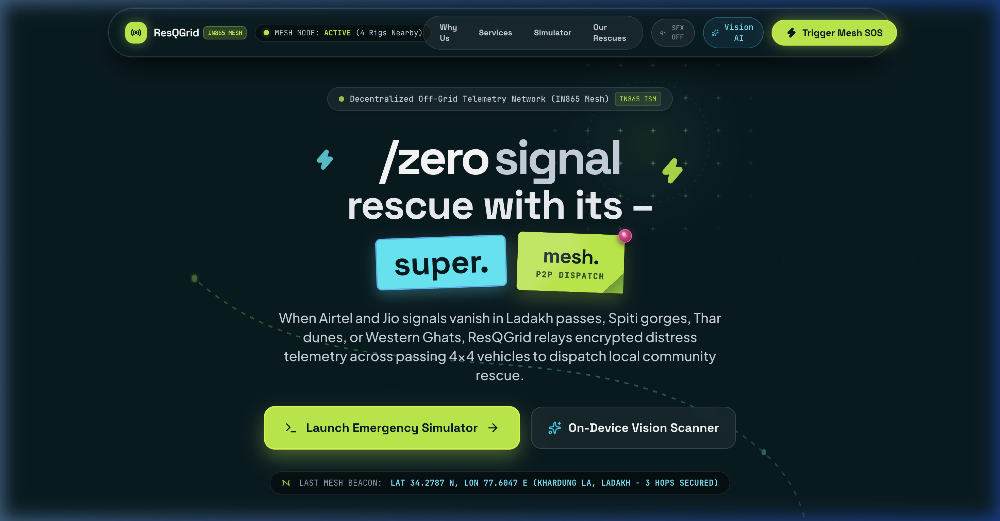
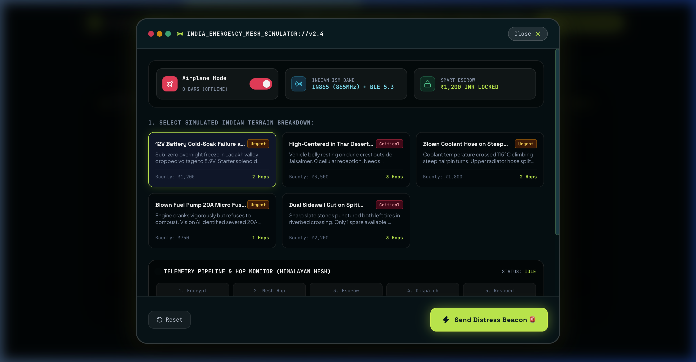
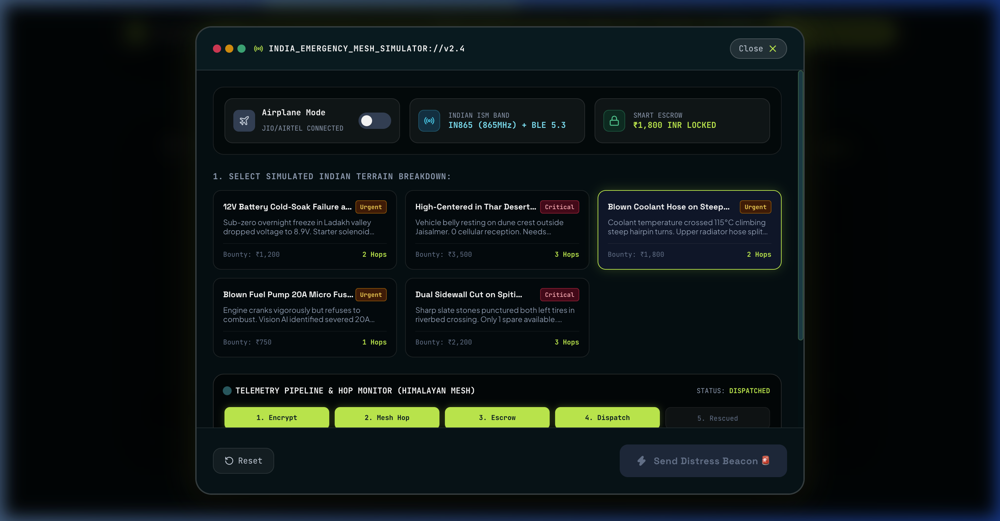
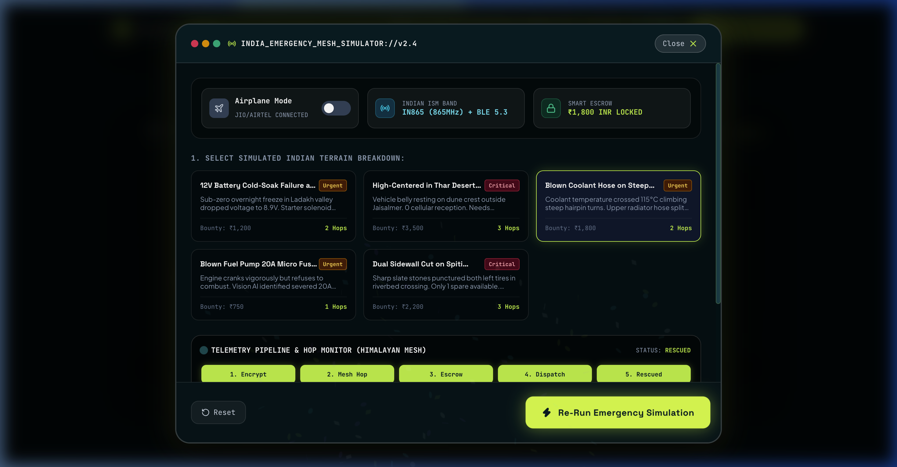
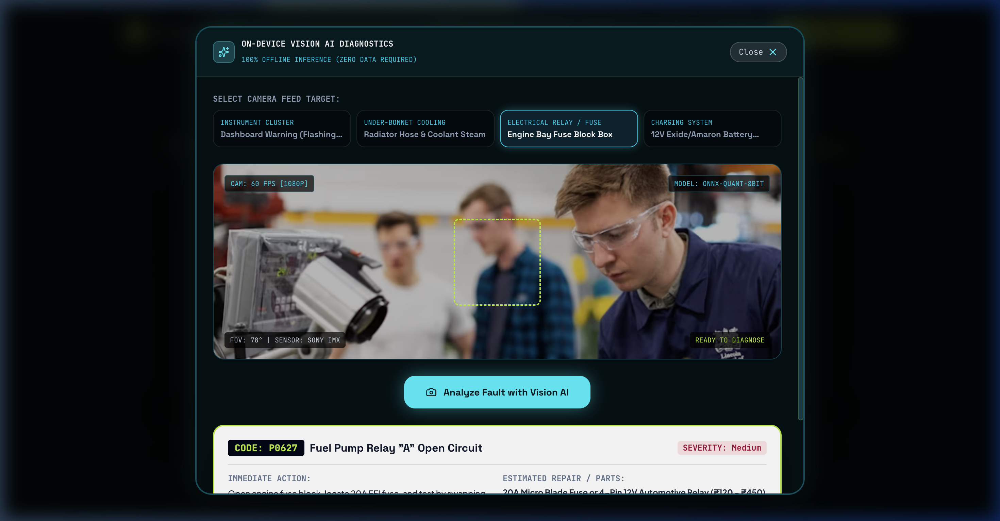

<div align="center">

# 🛰️ ResQGrid
### Next-Gen Decentralized Emergency Roadside Assistance & Off-Grid Mesh Rescue

[](https://resqgrid-eight.vercel.app/)
[](https://react.dev/)
[](https://vite.dev/)
[](https://tailwindcss.com/)
[](https://www.typescriptlang.org/)
[](https://www.framer.com/motion/)
[](https://github.com/Rushiiii505/ResQGrid)

<br/>

🌐 **Live Application URL**: [https://resqgrid-eight.vercel.app/](https://resqgrid-eight.vercel.app/)

<br/>

**ResQGrid** is a production-grade, decentralized emergency roadside rescue platform engineered for complete cellular dead-zones (Himalayan passes, Thar dunes, Spiti riverbeds, Western Ghats). When 4G/5G signals vanish, ResQGrid broadcasts encrypted peer-to-peer distress packets across passing vehicles and mountain repeater towers to dispatch verified local 4x4 community responders.

</div>

---

## 📸 Visual Showcase & Real Features

<div align="center">

### ⚡ Hero & Live Mesh Hop Telemetry


<br/>

### 🚨 Emergency Dispatch Terminal & Real Cross-Tab Mesh Bus
| Step 1: Breakdown & Offline Mode | Step 2: Mesh Hop & SubtleCrypto Escrow |
| :---: | :---: |
|  |  |

<br/>

### 🎯 Rescue Confirmation & Live WebCam Vision AI
| Step 3: Verified Handshake & Payout | Step 4: Live Camera Neural Scanner |
| :---: | :---: |
|  |  |

</div>

---

## ⚡ Real Functional Browser APIs

Unlike basic static mockups, ResQGrid is powered by **real browser hardware APIs**:

1. **📡 Real Cross-Tab Mesh Network (`BroadcastChannel`)**:
   - Open ResQGrid in two browser tabs.
   - Trigger an SOS in **Driver Mode** in Tab 1 — Tab 2 in **Responder Radar Mode** instantly receives the live distress beacon, sounds the radio siren, tracks GPS distance, and lets the responder accept the mission in real-time!

2. **📹 Real Device WebCam & Image Upload (`navigator.mediaDevices.getUserMedia`)**:
   - Tap **"Start Live Camera"** in the Vision AI scanner to stream your device's actual camera onto a hardware canvas with real-time HUD overlays.
   - Upload any real car dashboard/engine photo from disk for instant fault classification.

3. **🎙️ Microphone Voice Dispatch Memo Recorder (`MediaRecorder` API)**:
   - Record real spoken distress voice memos directly from your microphone and attach them to the broadcasted distress packet.

4. **🛰️ Real GPS Satellite Fix & Dead-Reckoning Compass (`navigator.geolocation` + IMU)**:
   - Queries real device GPS coordinates, altitude, heading, and calculates real Haversine distance in kilometers to stranded vehicles.

5. **🔐 Cryptographic Telemetry Signer (`SubtleCrypto` AES-256-GCM + SHA-256)**:
   - Real hardware-accelerated SHA-256 packet hashing, 256-bit AES-GCM payload encryption, and IV nonce generation.

6. **🚜 Dual-Role Switcher (Driver SOS Mode $\longleftrightarrow$ Responder Fleet Radar)**:
   - Switch seamlessly between stranded driver and responder fleet command view.
   - Responder dashboard includes equipment checklists, mission claiming, and escrow wallet balance in Indian Rupees (**₹**).

7. **📦 Offline `.resq` Emergency Packet Exporter**:
   - Download offline encrypted distress packets to flash drives or local storage to hand off to passing drivers.

8. **🔵 Web Bluetooth Peripheral Scanner (`navigator.bluetooth`)**:
   - Scan for nearby Bluetooth Low Energy (BLE) radio dongles, OBD-II scanners, and battery telemetry units.

---

## 🎨 Visual Design System & Aesthetics

* **Deep Teal Blueprint Matrix (`#041C20` to `#011215`):** Interactive canvas background with magnetic crosshairs, coordinates, and cursor proximity illumination.
* **Electric Lime (`#B6F014` / `#D4FF00`):** High-contrast neon accents for peelable sticker tags, primary dispatch CTAs, and active beacon rings.
* **Tactile Dog-Ear Paper Cards:** Skeuomorphic folded bottom-right corner flaps with realistic 3D paper drop shadows and spring physics.
* **3D Pushpins & Paper Clips:** Specular metallic highlights in cyan, magenta, lime, orange, and blue.
* **Curving SVG Trajectory Paths:** Organic dashed telemetry vectors meandering across sections with traveling node pulses.

---

## 🛠️ Tech Stack & Architecture

| Layer | Technology |
| :--- | :--- |
| **Framework** | [React 19](https://react.dev/) + [Vite 8](https://vite.dev/) |
| **Language** | [TypeScript 5](https://www.typescriptlang.org/) |
| **Styling** | [Tailwind CSS v4](https://tailwindcss.com/) + `@tailwindcss/vite` |
| **Real Web APIs** | BroadcastChannel, Web Audio API, MediaRecorder, getUserMedia, Geolocation, SubtleCrypto, Web Bluetooth |
| **Motion Physics** | [Framer Motion](https://www.framer.com/motion/) |
| **Icons & Visuals** | [Lucide React](https://lucide.dev/) + [Canvas Confetti](https://www.npmjs.com/package/canvas-confetti) |
| **Audio Engine** | Synthesized Web Audio API + Morse Code SOS Generator |
| **Typography** | Plus Jakarta Sans, Space Grotesk, JetBrains Mono |
| **Deployment** | [Vercel](https://vercel.com/) |

---

## 🚀 Getting Started

### Prerequisites
* Node.js `v18.0.0` or higher
* npm or pnpm

### Installation

```bash
# Clone the repository
git clone https://github.com/Rushiiii505/ResQGrid.git

# Navigate into project directory
cd ResQGrid

# Install dependencies
npm install

# Launch development server
npm run dev
```

The application will be live at `http://localhost:5173/`.

### Testing Real Cross-Tab Mesh Network:
1. Open `http://localhost:5173/` in **Tab 1**.
2. Open `http://localhost:5173/` in **Tab 2** and click **"Responder Radar"** in the top navbar.
3. In **Tab 1**, click **"Trigger Mesh SOS"** -> click **"Send Distress Beacon"**.
4. Switch to **Tab 2** — notice the live incoming distress signal, audible radio chirp, real GPS distance, and click **"Accept Mission & Deploy"** to claim the bounty!

---

## 📂 Project Structure

```
ResQGrid/
├── public/
│   └── demo/                 # Showcase screenshots & media assets
├── src/
│   ├── components/
│   │   ├── common/           # BlueprintGrid, FoldedPaperCard, PushPin, DecryptedText, StickerTag
│   │   ├── cta/              # FooterCTA with node subscriber
│   │   ├── hero/             # HeroSection & MeshRelayVisualizer
│   │   ├── navigation/       # Glassmorphic Navbar & SFX audio pill
│   │   ├── responder/        # Real-Time ResponderDashboard & Radar
│   │   ├── services/         # Tactile ServicesGrid & capability inspector
│   │   ├── simulator/        # EmergencySimulatorModal with voice recorder & crypto
│   │   ├── stats/            # WhyUsStats & interactive radius calculator
│   │   ├── vision/           # VisionScannerModal with live WebCam & upload
│   │   └── work/             # OurWorkShowcase polaroid rescue records
│   ├── utils/
│   │   ├── cryptoEngine.ts   # Real AES-256-GCM & SHA-256 SubtleCrypto
│   │   ├── geoEngine.ts      # Real Geolocation & Dead-Reckoning Compass
│   │   ├── realMeshBus.ts    # BroadcastChannel cross-tab mesh & Web Bluetooth
│   │   ├── mockData.ts       # Indian geography, rescue telemetry, OBD database
│   │   └── soundEngine.ts    # Web Audio API FX & Morse Code SOS generator
│   ├── App.tsx               # Root container with Driver & Responder dual mode
│   ├── index.css             # Tailwind v4 theme, dog-ear folds & blueprint tokens
│   └── main.tsx              # React DOM entrypoint
├── package.json
├── tsconfig.json
├── vite.config.ts
├── vercel.json
└── README.md
```

---

## 🛡️ License

Distributed under the **MIT License**. See `LICENSE` for more information.

<div align="center">
Built with ⚡ for off-grid explorers, overlanders, and emergency responders.
</div>
